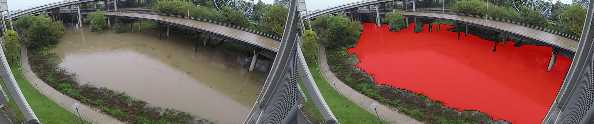
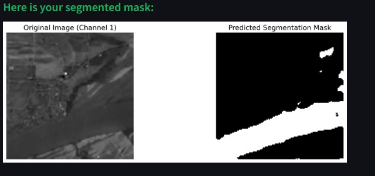

# Water Segmentation with U-Net 🌊



## Overview

This project demonstrates water body segmentation from satellite images using a U-Net model implemented in PyTorch. The model is designed to predict water regions within TIFF images that contain 12 channels. The application is built using Streamlit to provide an interactive interface where users can upload images and visualize segmentation results.

## Features

- **U-Net Architecture**: Implements a classic U-Net model with double convolutional layers and skip connections, optimized for segmentation tasks.
- **Interactive Web App**: Built with Streamlit, the app provides a friendly interface where users can upload their TIFF images and instantly see the segmentation results.
- **Real-Time Processing**: Processes and segments the uploaded images in real-time, displaying both the original image and the segmented mask side by side.
- **User-Friendly Interface**: The app includes emojis, progress indicators, and success messages to enhance user experience.

## Demo



## Installation

### Prerequisites

- Python 3.7 or higher
- PyTorch
- Streamlit
- rasterio
- Matplotlib

### Step-by-Step Guide

1. **Clone the repository**:

   ```bash
   git clone https://github.com/MSoffar/Water-Segmentation-UNet-Streamlit.git
   cd Water-Segmentation-UNet-Streamli
   ```

2. **Create a virtual environment** (optional but recommended):

   ```bash
   python -m venv venv
   source venv/bin/activate  # On Windows use `venv\Scripts\activate`
   ```

3. **Install the required dependencies**:

   ```bash
   pip install -r requirements.txt
   ```

4. **Run the Streamlit app**:

   ```bash
   streamlit run app.py
   ```

5. **Upload a TIFF image**: Open the app in your browser, upload a TIFF image, and view the segmentation results.

## Usage

- **Upload a TIFF image**: The app supports images with 12 channels. Simply drag and drop or select the file from your system.
- **View Results**: The app will display the original image and the predicted segmentation mask side by side.

## Customization

- **Theme**: The theme settings for the Streamlit app can be customized in the `.streamlit/config.toml` file.
- **Model**: You can replace `best_model.pth` with your own model weights if needed.

## Contributing

Contributions are welcome! Please feel free to submit a Pull Request.

1. Fork the repository
2. Create your feature branch (`git checkout -b feature/my-new-feature`)
3. Commit your changes (`git commit -am 'Add some feature'`)
4. Push to the branch (`git push origin feature/my-new-feature`)
5. Create a new Pull Request

## Acknowledgements

- This project was inspired by [U-Net: Convolutional Networks for Biomedical Image Segmentation](https://arxiv.org/abs/1505.04597).
- Thanks to the open-source community for providing the libraries and resources used in this project.

## Contact

For any inquiries, please reach out to [mohamedsoffar22@outlook.com]

---

*Happy Segmenting! 🎉*
```

